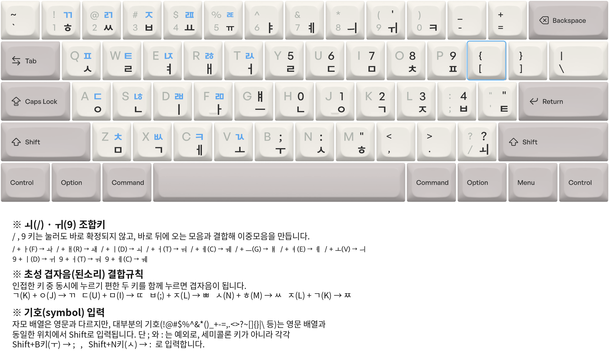

# 세벌식 최종 순아래

세벌식 최종 순아래는 세벌식 최종(391)을 바탕으로, 자주 쓰는 조합을 Shift 없이 입력할 수 있도록 구성한 자판이다.

## 배열 읽기

- 검은 글자는 단독 입력 또는 Shift 입력으로 나오는 글자이다.
- 파란 글자와 파란 테두리의 `[` 키는 `[`를 종성조합글쇠로 쓸 때 입력하는 자소와 겹받침을 나타낸다.
- `ㅚ(/)`와 `ㅟ(9)`는 누른 직후 확정되지 않으며, 뒤따르는 모음과 조합해 이중모음을 만든다. 세부 조합표는 이미지 하단 범례에 정리되어 있다.
- `ㅚ(/)`와 `ㅟ(9)`는 조합 중인 한글이 없을 때 입력기가 처리하지 않으므로, 각각 `/`와 `'`로 입력된다.

## 설계 특징

- **세벌식 최종과의 호환성**: 기본 배열을 유지하고, 조합 규칙을 추가해 기능을 확장한다. 조합용 모음 자리에서는 단독 입력을 `ㅚ(/)`와 `ㅟ(9)`로 바꿔 타수를 줄인다.
- **Shift 없는 한글 조합**: 한글 조합에서 Shift를 쓰지 않고, 겹초성·겹받침·일부 모음을 조합 규칙으로 입력한다.
- **모아치기 우선**: 한 음절에서 같은 키를 두 번 누르는 일을 피하고, 인접 초성 키를 함께 눌러 겹초성을 만든다.

## 초성 겹자음

인접한 두 초성 키를 함께 누르면 초성 겹자음을 입력할 수 있다.

- `ㄱ(K) + ㅇ(J) → ㄲ`
- `ㄷ(U) + ㅁ(I) → ㄸ`
- `ㅂ(;) + ㅈ(L) → ㅃ`
- `ㅅ(N) + ㅎ(M) → ㅆ`
- `ㅈ(L) + ㄱ(K) → ㅉ`

## 참고

- [세벌식 최종(391) 자판의 개선안](https://text.youknowone.org/post/106848470561/3final-noshift)
- 구름 입력기의 [3gs 자판 정의](../../OSXCore/data/keyboards/hangul-keyboard-3gs.xml)
- 구름 입력기의 [3gs 조합 정의](../../OSXCore/data/keyboards/hangul-combination-3gs.xml)

배열 이미지는 [#938](https://github.com/gureum/gureum/issues/938)에서 MunsuBahk가 제공했으며, 프로젝트 문서에 포함할 수 있도록 재배포와 수정을 허용했다.
